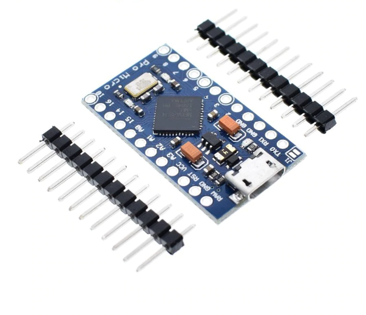

# arduino_lowpower

## Description

Sleep mode implementation

## Hardware

Pro Micro ATmega32U4 5V 16MHz :

- [ ] [Schematic](https://www.kitronik.co.uk/pdf/46101_schematic.pdf)
- [ ] [Datasheet](https://www.microchip.com/wwwproducts/en/ATmega32u4)
